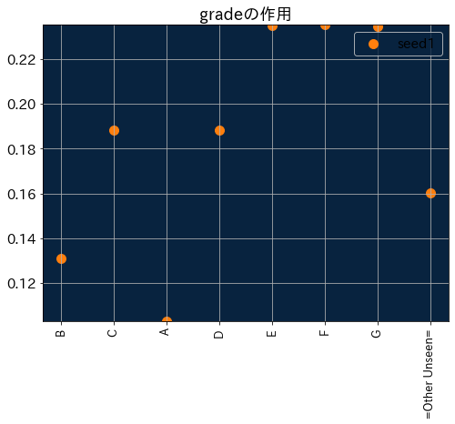
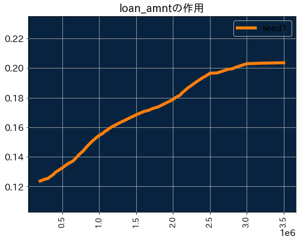
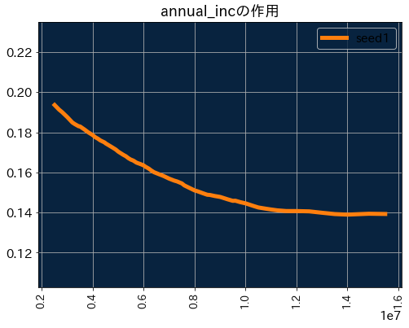
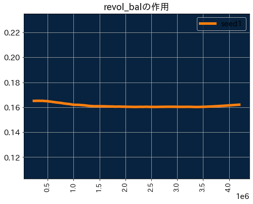
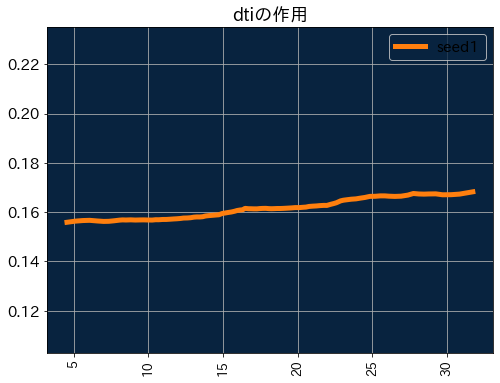
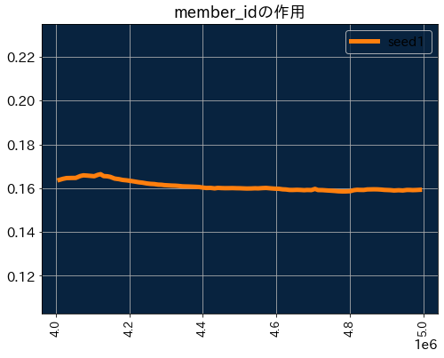
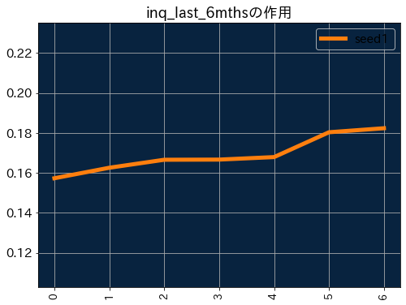
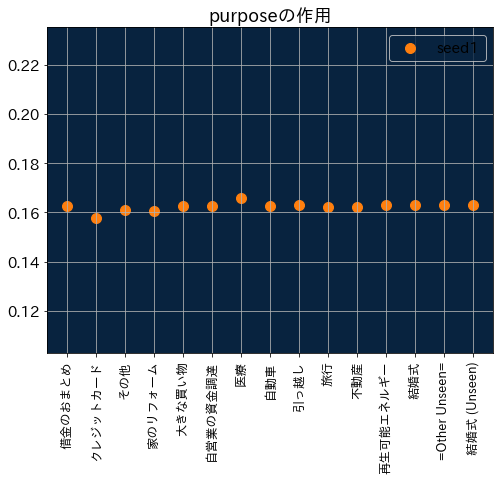
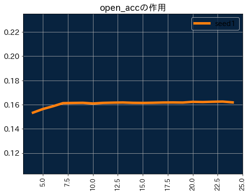

# ユーザーの好みの変化の要因分析結果

## 分析結果

### サマリ

*  **grade, loan_amnt, annual_inc, revol_bal, dti, member_id, inq_last_6mths, emp_title, purpose, open_acc**  は特に好みの変化に対する影響が大きい。

### 詳細

#### 1. モデル情報

* 最も精度の良いモデル: ExtraTrees Classifier (Gini)
* 精度: AUC 0.676 (最もF1 Scoreが高い閾値での陽性的中率 0.238)

#### 2. 特徴量のインパクト

*  **grade, loan_amnt, annual_inc, revol_bal, dti, member_id, inq_last_6mths, emp_title, purpose, open_acc**  は特に好みの変化に対する影響が大きい。

.png)

#### 3. 特徴量ごとの作用

##### ワードクラウド

##### grade

##### loan_amnt

##### annual_inc

##### revol_bal

##### dti

##### member_id

##### inq_last_6mths

##### emp_title

##### purpose

##### open_acc

## 分析設定

### 分析対象データ

|  項目  |  詳細  |
| ---- | ---- |
|  入力ファイル名  |  /Users/mon/Desktop/aia_test_02/input/lending_club_5000.csv  |
|  レコード数  |  5000  |
|  データ期間  |   ~   |
|  ターゲットの割合  |  16.42 %  |

### モデリングの設定

|  項目  |  詳細  |
| ---- | ---- |
|  モデリングモード  |  オートパイロット  |
|  モデルの最適化指標  |  AUC  |
|  パーティションの決定方法  |  層化抽出  |
|  交差検定の分割数  |  5  |
|  ホールドアウトの割合  |  0 %  |

### DataRobot参照先

* プロジェクトID: 5f85e73425132a0427978946
* プロジェクト名: 20201014_lending_club_5000.csv_Seed1
